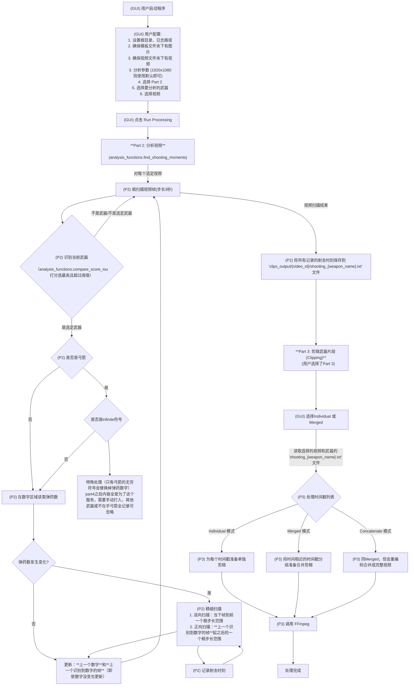

# Apex_things

## 使用说明

### 配置环境

- 下载`yt-dlp.exe`: [github地址](https://github.com/yt-dlp/yt-dlp/releases)
- 下载`ffmpeg.exe`: [官方地址](https://www.ffmpeg.org/download.html#build-windows)，选择 download source code，解压找到bin文件下的`ffmpeg.exe`，其他不要。
- 把`yt-dlp.exe`和`ffmpeg.exe`放到某个储存用的文件夹中，windows搜索`编辑系统环境变量`，打开此设置，点击`环境变量`，在`系统变量`的列表中滚动找到变量`Path`那一行，双击，在新窗口中选择`新建`，把放两个exe的文件路径复制在这里。然后把之前打开的窗口点击应用或者确认。设置成功。（如果之后出现相关找不到的报错，重启试试）

### 下载视频

下载视频直接用 `bash` 更推荐，windows下随便在某文件夹目录shift+右键后选择powershell打开，输入下方 `yt-dlp` 开头的代码即可。如果你有自己的录像，不用下载可忽略。（目前我的模板是根据1920x1080的录像截取的，不同尺寸录像请仿照命名替换现有的）

显示信息
```bash
yt-dlp -F https://www.youtube.com/watch?v=ID
```

bash用
```bash
yt-dlp "https://www.twitch.tv/videos/视频链接" -o "E:\xxxx\xxxx\保存位置.mp4" -f "bestvideo[ext=mp4]+bestaudio[ext=m4a]/mp4" --download-sections "*00:17:00-05:02:10"
```
python用
```python
command = [
        'yt-dlp', video_url,
        '-f', "bestvideo[ext=mp4]+bestaudio[ext=m4a]/mp4",
        '-o', file_mp4,
        '--merge-output-format', 'mp4',
        '--download-sections', f"*{start_time}-{end_time}"
]
downloaded_file_path = subprocess.run(command, check=True, text=True, capture_output=True, encoding='utf-8')
```

如果用本工具下载视频，`video_urls.txt`用于决定要下载哪些视频。每行格式为`https://www.twitch.tv/videos/xxxxxx,02:29:30.000,05:37:10.000`下载完成后，之后的处理中的时间戳都以本地视频为准，而不是原网络视频的时间。下载和分析两个部分互相独立。

偶尔会有无法续传的情况，经验上bash会好一点。如果发现下载停止，可以不关bash，把网重新连一下续传概率更高。

### 视频分析

请勾选part2。勾选想要分析的武器类型。如果是全记录，则全选即可。

## 目录结构

`pic_template`中为要准备的图片。其他文件内的东西是自动生成的结果。如果要对某视频重新运行，注意删除对应内容下的对应内容，因为我的代码没有提示覆盖选项，对于已存在的文件会直接跳过。

```
root_directory/
├── pic_template/
│   ├── template.png  # 弓箭图片
│   ├── template2.png # 无穷图片
│   ├── left/
│   │   ├── 0l.png
│   │   ├── 1l.png
│   │   ├── 2l.png
│   │   ├── 3l.png
│   │   └── 4l.png
│   └── right/
│       ├── 0r.png
│       ├── 1r.png
│       ├── 2r.png
│       ├── 3r.png
│       ├── 4r.png
│       ├── 5r.png
│       ├── 6r.png
│       ├── 7r.png
│       ├── 8r.png
│       └── 9r.png
├── downloaded_videos/
├── clips_output/
│   └── 2462742265/
│       ├── all_weapons.txt
│       ├── shooting_g7.txt
│       ├── shooting_longbow.txt
│       ├── ...
│       ├── shooting_bow.txt
│       ├── infinite.txt
│       ├── infinite_2.txt
│       ├── infinite_3.txt
│       ├── shooting_bow_sum.txt
│       ├── clips_merged/
│       └── 2468733556_intermediate_reencoded_parts/
│           └── intermediate_segment_0000.mp4
│           ├── ...
```
## 流程图


## 特殊说明
- 为什么Concatenate模式要重新编码，不直接合并？因为对于这种剪出来的片段其声音轨道和图像轨道的时间戳似乎是乱的，直接合并会出现音画不同步现象。解决方式一种是选择Concatenate模式的重编码再合并，另一种是选择Individual模式或Merged模式得到很多片段，然后把这些片段拖入Pr等剪辑软件，也能做到，并且专业剪辑软件渲染更快。坏处是太多片段，Pr加载时会过载。
- 特殊说明（part4-part5）：只有当你非常在乎要统计所有的弓箭射击时，才需要此功能。因为只有弓箭在老爷爷大招时，无穷大符号会覆盖原有的子弹数量的位置，无法再通过数字变化来判断射击时刻。特殊处理，识别无穷大符号。这些粗略时间统计在infinite.txt中。手动查看infinite.txt然后以每行`01:00:03.000 - 01:00:57.000`的格式写出要的时间范围，保存为`infinite_2.txt`，喂给part4处理。然后把这些片段拖到Pr等剪辑软件中，确定每一发射击的精确时间，以每行`02:48:11.000 - 00:00:09:04 00:00:10:14 00:00:11:11 00:00:20:16`的格式保存为`infinite_3.txt`，然后给part5处理，得到所有发射的总记录文件`shooting_bow_sum.txt`。
- 粗扫描的步长下，还是会有漏网之鱼，例如哨兵满子弹开了一枪换弹装满恰好卡在一个步长内，则会被忽略。目前3秒还行，2.5秒可能更合适。目前更新为默认2.8秒。你可以手动设置，理论上是越小越精确，运算时间越长。
- 根据最近的测试，`7小时视频`，`步长2.8秒全武器分析`时间为`1小时`，剪成片段时间1分钟以内，编码合并模式生产完整视频需要`40分钟`。相当花时间，值得大幅提高。

## 待更新列表
- [ ] 目前只支持1920x1080，主要是模板识别处，待后续扩展更新。
- [ ] audio_approach 枪声识别不太精准，先搁置。
- [ ] 武器模板缺少单枪p2020，单枪莫桑比克，L-star（未设计它的逻辑，可能跟弓箭类似处理）等。待补全。
- [ ] 增加可选模式，对视频整体进行音量检测，粗筛选开枪范围，减少扫描范围。（适用于无人声视频）
- [ ] 哨兵等枪在装弹时会拿下弹夹，如果恰好剩一发子弹，子弹数量会经过 `1 -> 0 -> 4` 的过程，换单会被检测为开枪。其他自动枪剩3发以内换枪也会这样。从实践结果看这样的换弹误检测不多，且不影响观看体验，暂时不管。
pyinstaller --noconfirm --windowed --icon=icon.ico Apexcut_ch.py
