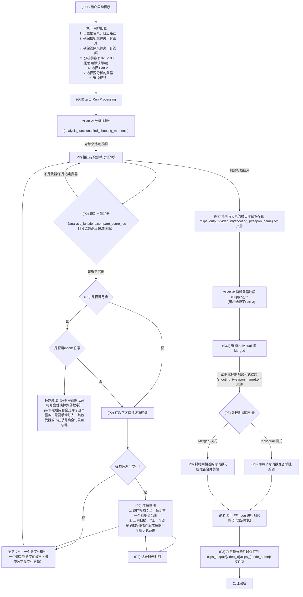

# Apex_things

## 下载视频

显示信息
```bash
yt-dlp -F https://www.youtube.com/watch?v=ID
```

bash用
```bash
yt-dlp "https://www.twitch.tv/videos/视频链接" -o "E:\xxxx\xxxx\保存位置.mp4" -f "bestvideo[ext=mp4]+bestaudio[ext=m4a]/mp4" --download-sections "*00:17:00-05:02:10"
```
python用
```python
command = [
        'yt-dlp', video_url,
        '-f', "bestvideo[ext=mp4]+bestaudio[ext=m4a]/mp4",
        '-o', file_mp4,
        '--merge-output-format', 'mp4',
        '--download-sections', f"*{start_time}-{end_time}"
]
downloaded_file_path = subprocess.run(command, check=True, text=True, capture_output=True, encoding='utf-8')
```

偶尔会有无法续传的情况，经验上bash会好一点。如果发现下载停止，可以不关bash，把网重新连一下续传概率更高。

## 目录结构
```
root_directory/
├── pic_template/
│   ├── template.png  # 弓箭图片
│   ├── template2.png # 无穷图片
│   ├── left/
│   │   ├── 0l.png
│   │   ├── 1l.png
│   │   ├── 2l.png
│   │   ├── 3l.png
│   │   └── 4l.png
│   └── right/
│       ├── 0r.png
│       ├── 1r.png
│       ├── 2r.png
│       ├── 3r.png
│       ├── 4r.png
│       ├── 5r.png
│       ├── 6r.png
│       ├── 7r.png
│       ├── 8r.png
│       └── 9r.png
├── downloaded_videos/
├── clips_output/
│   └── 2462742265/
│       ├── shooting_bow.txt
│       ├── infinite.txt
│       ├── infinite_2.txt
│       ├── infinite_3.txt
│       └── shooting_bow_sum.txt
```
## 流程图



## 使用说明

- 下载视频直接用 `bash` 更推荐，windows下随便在某文件夹目录shift+右键后选择powershell打开，输入上方下载 `yt-dlp` 开头的代码即可。
- 如果用本工具下载视频，`video_urls.txt`用于决定要下载哪些视频。每行格式为`https://www.twitch.tv/videos/xxxxxx,02:29:30.000,05:37:10.000`下载完成后，之后的处理中的时间戳都已本地视频为准，而不是原网络视频的时间。下载和处理两个部分互相独立。
- `pic_template`文件夹里存储模板图片，要放到主路径中。弓箭对应`template.png` 无穷符号对应`template2.png`。`pic_template\left` 存储左侧的数字，右侧的同理。
- 点击 `Refresh Video List` 勾选要进行处理的视频
- infinite是老爷爷大招的时间检测，为粗略时间统计在infinite.txt中。手动查看infinite.txt然后以每行`01:00:03.000 - 01:00:57.000`的格式写出要的时间范围，保存为`infinite_2.txt`，为给part4处理。然后把这些片段拖到Pr中，确定每一法的精确时间，以每行`02:48:11.000 - 00:00:09:04 00:00:10:14 00:00:11:11 00:00:20:16`的格式保存为`infinite_3.txt`，然后给part5处理，得到所有发射的总记录文件`shooting_bow_sum.txt`。如果不想麻烦处理infinite问题，只需要前两步即可。

## 未解决问题

- audio_approach 不太精准，先搁置。
- 可能对视频整体进行音量检测，粗筛选开枪范围，会减少运行时间。（无人声视频）未来可考虑增加此功能。
- 粗扫描的步长下，还是会有漏网之鱼，例如哨兵满子弹开了一枪换弹装满恰好卡在一个步长内，则会被忽略。目前3秒还行，2.5秒可能更合适。
- 哨兵等枪在装弹时会拿下弹夹，如果恰好剩一发子弹，子弹数量会经过 `1 -> 0 -> 4` 的过程，换单会被检测为开枪。其他自动枪剩3发以内换枪也会这样。
